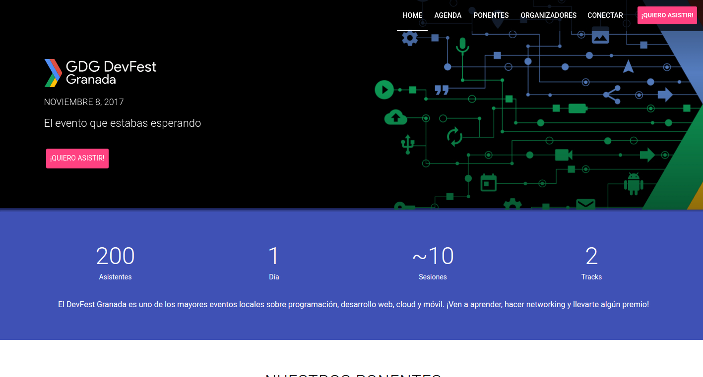

# GDG DevFest Granada

This is the website for the [GDG DevFest Granada 2017](https://devfest.gdggranada.com/)

It is a fork from [hoverboard](https://github.com/gdg-x/hoverboard). You can read this repository to learn more about this app.

## Run the web
### Run using Docker
Build the docker image:

    docker build -t hoverboard .

## Run on your computer
### Install dependencies

    npm install

##### Start the development server

This command serves the app at `http://localhost:3000` and provides basic URL
routing for the app:

    npm run serve
    
Or you can serve Docker container:

    docker run -v "$PWD":/app hoverboard

### Build

This command performs HTML, CSS, and JS minification on the application
dependencies, and generates a service-worker.js file with code to pre-cache the
dependencies based on the entrypoint and fragments specified in `polymer.json`.
The minified files are output to the `build`.

    npm run build

## License

Project is published under the [MIT license](https://github.com/gdg-x/hoverboard/blob/master/LICENSE.md).  
Feel free to clone and modify repo as you want, but don't forget to add reference to authors :)
